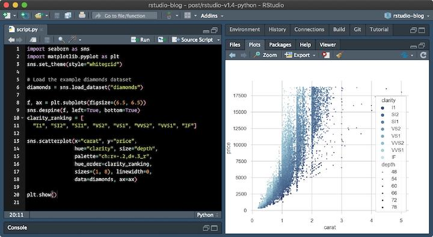

# 1 Ad Hoc work

## Starting point

Everyone starts somewhere. Usually every project in the beginning starts by someone trying something out a possible solution to a
business problem with perhaps hardcoded minimal inputs and outputs. However at this point code may not be well named or organised.
Probably at this point this is not work that will be ready for sharing more widely. 

## Can we do better?

There are some ways that even in this initial stage work can be useful as a stepping stone to next steps. 

An analyst can work in an exploratory mode, investigating processes and building familiarity with the problem domain. 
Usually work in this step is comprised of single file/ page programs that are in one file also known as `scripts` 

!!! info
    the focus on this first step should be on learning and reducing uncertainties. 
    Its an important first step on learning how to automate processes via programming and 
    not doing things by hand / manually. 

## Why someone should want to use Jupyter Notebooks?

By using technologies such as Jupyter notebooks (in Python/R) an analyst is able to explain how a process works to other people or him/herself after 6 months (!).Jupyter notebooks provide a quick and streamlined way for problem-solvers to prototype code and quickly share it. So in order to get started it is usually very helpful to have some code running in a Jupyter notebook

In a way, Jupyter notebooks strike a balance between simple text editors, which are fast to start and simple and easy to manipulate, and `IDE`'s (an acronym for "Integrated Development Environment") which tend to start slower and be feature-rich and complex. Simple text editors typically can only edit code, and cannot run the code. A full `IDE` can edit code, run the code, debug code, provide syntax highlighting and context help. In the context of problem-solving, Jupyter notebooks are quite handy. Jupyter notebooks open quickly and quickly produce output. Data exploration, data cleaning, and plot building are accomplished in Jupyter notebooks easier and quicker than in a text editor or an IDE.

## Why someone should not work ONLY with Jupyter Notebooks and work with an IDE

Jupyer notebooks are great for telling data stories. But, unless we are doing pure research, our research is the means to an end — and that is, getting valuable insights from our data stories and data models.

A production-grade pipeline needs to be composed out of debuggable, reproducible, easy-to-deploy, high-performance code components that could be orchestrated and scheduled. In its default version, it’s everything adhoc code on Jupyter isn’t.

Out of 400 cells, could cell # 273 run even if cell #50 did not run? What if it did run, but on a different data, reading different data? Are cell #200’s results immutable? I.e. can we re-run it and get the same results, or will a re-run fail/return different results?

There is no easy way of answering any of those questions while developing on a Jupyter Notebook.

You have to rely on your human memory to know which cell could run with/without other cells, which cell is re-runnable, etc. 
This just doesn’t work. Basically, what most data scientists do when they are unsure about the state of a notebook, is just trigger a complete re-run of the entire notebook, which is a complete waste of time and resources.

Notebooks are useful tools for interactive data exploration which is the dominant activity when working on the early phase of a new project or exploring a new technique. But once an approach has been settled on, the focus needs to shift to building a structured codebase around this approach while retaining some ability to experiment. 

## So what is the solution?

For R the use of [RStudio](https://www.rstudio.com/products/rstudio/), a fully fledged IDE ("Integrated Development Environment") is recommended. Thankfully that should not be a big change to an analyst as its the main way most people use R these days.

{ align=left }

For Python [VSCode](https://code.visualstudio.com/) is recommended.

{ align=left }

## Next Steps

While just getting something to work in order to prove a point is good as far as running an adhoc program is concerned, 
there are a few ways of improving the work we can produce. Hopefully you will find some interesting suggestions on how to do this in the following sections.

!!! info inline end "what we want to avoid"
    { align=left }
    image courtesy of [Piled Higher and Deeper / PHDComics](https://phdcomics.com/comics/aboutcomics.php)

