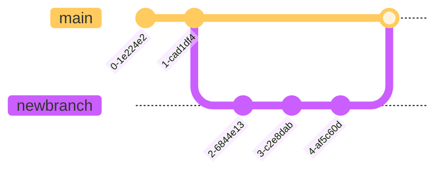

``` bash name="git process"
git pull #for the latest in the repo you want
git checkout -b MYNEWBRANCH #or any other name to start your own

# code writing  here 
git add FILES  
git commit -m "commit message here"

# more code writing here 
git add FILES 
git commit -m "commit message here"

# even more code writing  
git add FILES 
git commit -m "commit message here"


git push -u origin MYNEWBRANCH
```

        

