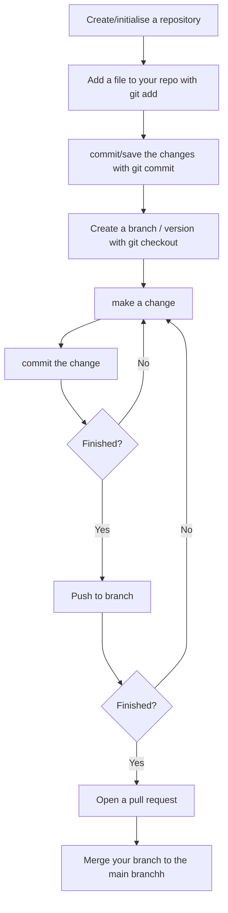

# 5 Version control


## Motivation

Version control helps us understand what changes we made in the past or why we did a specific analysis in the way we did it, even weeks or months later. With the help of comments and commit messages, each version can explain what changes it contains compared to the previous versions. 
This is helpful in order to be able to share our analysis  and make it auditable or reproducible - which is good scientific practice.

A version control system neatly stores a history of changes and who made them, so while it is still easy to access them, your working directory is not cluttered by the debris of previous versions that are necessary to keep just in case. Similarly, with version control, there is no need to leave chunks of code commented should you ever need to come back to an old version again.

Finally, version control is invaluable *for collaborative projects where different people work on the same code simultaneously* and build on each other’s work. It allows the changes made by different people to be tracked and can automatically combine people’s work while saving a great deal of painstaking effort to do so manually. Using version control for your research project means that your work is totally transparent, and because all your actions are recorded, it enables others to reproduce your studies. Moreover, version control hosting services such as `GitHub` provide a way to communicate and collaborate in a more structured way, such as in pull requests, code reviews, and issues.

In BOLD we would like to encourage sharing the code used to produce the data analysis we produce as this enhances accessibility and reuse by others. In this way other analysts can:

- [x] benefit from your work and build on it
- [x] learn from your experiences
- [x] find uses for your code which you had not thought of!

## Difference between Git and Github. 

If you are new to Git and Github, it is worth clarifying the difference between Git and Github. Git is the software that looks after the version control of code, whereas Github is the website on which you publish and share your version controlled code. In practice this means you use Git to track versions of your code, and then submit those changes to Github.

## Can I only use the Github web interface?

One of the attributes of git is that usually used through a CLI (Command Line Interface) on a console window. Not all people
are comfortable with the command line or sometimes the computers they work on dont allow this (!)

If its not possible to use the command line to use git it is very much worth using Github via its web interface.
Having saved work at specific poinst in time is always useful.

Github also offers some very helpful tools for project managment in a repository through the web interface. Some of them are:

- [x] the `GitHub Issues` tracker that can be used in order to track work, feedback, tasks, or bugs. [Here](https://docs.github.com/en/issues/tracking-your-work-with-issues/creating-an-issue) is how you can easily create an issue in a repository.
      
- [x] `Github Discussions` : A place where ideas can be discussed that perhaps can then become tasks to do. [Here](https://docs.github.com/en/discussions/quickstart) is a quickstart guide on Github Discussions


## So how you can have version control with Git/Github? . 

You can

- [x] Create files - these may contain text, code or both.
- [x] Work on these files, by changing, deleting or adding new content.
- [x] Create a snapshot of the file status (also known as version) at this time.


This process of creating a snapshot is described as a “commit”. As you keep saving your work by adding changes, you make more and more snapshots. You can think of these as saving versions of these files while documenting their history. If you need to go back to a previous version of a file because of a mistake, or if you changed your mind about a previous update, you can access the file in your preferred version, or return your entire project to a past state.


## Non-Linear Development of Your Project with “Branches”


So you have your project and you want to add something new or try something out before reflecting the changes in the main project folder. To add something new, you can continue editing your files and save them with the proposed changes. Suppose you want to try something without reflecting the changes in the central repository. In that case, you can use the “branching” feature . A `branch` creates a local copy of the main repository where you can work and try new changes. Any work you do on your branch will not be reflected on your main project (referred to as your main branch) so it remains secure and error-free. At the same time, you can test your ideas and troubleshoot in a local branch.


When you are happy with the new changes, you can introduce them to the main project. The merge feature in Git allows the independent lines of development in a local branch to get integrated into the main branch.


## Basic Git Workflow

=== "example git workflow"
``` bash title="example git command sequence"
git pull #for the latest in the repo you want
git checkout -b MYNEWBRANCH #or any other name to start your own

# code writing  here 
git add FILES  
git commit -m "commit message here"

# more code writing here 
git add FILES 
git commit -m "commit message here"

# even more code writing  
git add FILES 
git commit -m "commit message here"

git push -u origin MYNEWBRANCH

# got to github repo at branch MYNEWBRANCH
# PULL REQUEST from Github Interface
```
=== "git workflow flowchart"


## Git recommendations


!!! info inline end "Commit little and often"
    You should commit often and with small changes. One benefit of doing this is that you can identify possible bugs more easily because fewer things are changing at the same time. 


- [x] Make your project version controlled by initialising a Git repository in its directory using `git init` 
- [x] Add and commit all your files to the repository using `git add .` then `git commit -m "my informative message here` 
- [x] Commit messages should be meaningful and informative
- [x] In case you want to  make changes in specific files only to be committed with `git add <FILE> ` then `git commit -m "my informative message here"` 
- [x] Each commit preferably should make one simple change. Commit often as it makes it easier to be able to return to specific points in your project if something goes wrong. More commits more savepoints !
- [x] Develop new features of your project on their own branches, which you can create via `git checkout -b <MYNEWBRANCH>` and switch between via `git checkout < MYNEWBRANCH >` 
- [x] Make sure branches have informative names too. 
- [x] Make sure the main branch is kept clean. Only release level code should be here.
- [x] Make sure each branch has a single purpose and only changes related to that purpose are made on it.  
- [x] Once work on a branch  is complete, it is recommended that a Pull Request is sent for review 


## Code review

Code review provides additional assurance that code logic is correct, as well as providing feedback on code and problem structuring. For smaller projects, the review only needs to be a simple read-through and sanity check.

Code reviews should be initiated through the creation of a pull request. The review should typically involve the reviewer pulling the code to their local machine, testing it, and leaving comments in the pull request.

Remember that it’s always easier (for both you and your reviewers) if you commit and push your changes regularly. You should merge branches into the master regularly so that reviewers review little and often, rather than attempting to review your entire codebase all at once.


## Git turorials and interesting recommended sources of information


- [github quickstart tutorial](https://docs.github.com/en/get-started/quickstart/hello-world) from Github documentation
- Learn git with an [interactive git simulator](https://learngitbranching.js.org/) . Chapter 1/2/3 of the "Introduction Sequence" recommended for beginners. After that feel free to discover other less essential but still useful information on how to use git. 
- Did things go horribly wrong while using git? [Dangitgit](https://dangitgit.com/en) to the rescue.
- Want to see if you understand branches well? [Here](https://questions.wizardzines.com/git-branches.html) are some questions to test your understanding
- a book for git called [Pro Git](https://git-scm.com/book/en/v2) that is free
- explore what you can do with git and get the command you need with [gitexplorer](https://gitexplorer.com/)


