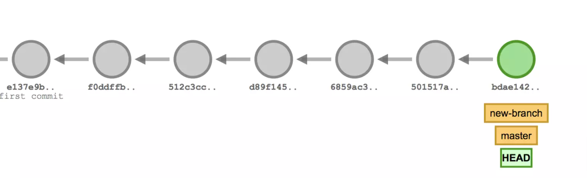

# 6 Reproducible and reusable work


## Dependency managment

There is a need to manage project dependencies. This can be done with dependency management tools (Renv for R /Conda for Python).

One solution is using conda for this as it also isntalls libraries in binary format for particular machines (Windows/OSX/Linux).
This is quite useful as a lot of times many packages use what is known as bootstrapping where they are compiled from source code 
to binary on the analyst’s computer. 

Something that is problematic is that most analyst computers are locked down as far as access and writing permissions 
are concerned or they might not include the right C++ compiler. Using conda to install the packages 
needed in already compiled binary format saves a lot of headaches as far as reproducibility is concerned.


## Data is immutable

- Don't ever edit your raw data, especially not manually, and especially not in Excel. Don't overwrite your raw data. Don't save multiple versions of the raw data. Treat the data (and its format) as immutable. 
- The code you write should move the raw data through a pipeline to your final analysis. 
- You shouldn't have to run all of the steps every time you want to make a new figure 


## Data and code lineage

Another matter that can help with reproducibility and pays dividends to be aware of is code and data provenance and lineage. 

Different code can understandably give different results. One way to help navigate this is by having 
the output of your analysis to also include the git hash of the code that produced it.

=== "Python"
```py 
import subprocess
def get_git_revision_hash():
    return subprocess.check_output(['git', 'rev-parse', 'HEAD'])
def get_git_revision_short_hash():
    return subprocess.check_output(['git', 'rev-parse', '--short', 'HEAD'])
```
  
=== "R"
```r 
library(git2r)
repo <- repository(".")
print(repository_head(repo))
```

  
There is also a need to do the same for data: Analysis that starts from a different point might have a different result. 
The solution is to include a hash of the data or any other way to help identifying the starting point of an analysis. 
MD5 or SH256 can help here
  
example in command prompt:  
  

=== "Windows"
```bash 
  certutil -hashfile <file> MD5
```
  
=== "OSX/Linux"
```bash 
  md5  <file> 
```

  
### Keep data out of version control

You really don't want to leak your data on a public repo on Github. The way to do this is to learn use `.gitignore`. 
In this way data files should never get committed into the version control repository. 
You can see below hypothetical .gitignore examples for Python and R

=== "Python"

``` bash
# keep data files in directory DATADIR out of the repo
DATADIR/  

# Byte-compiled / optimized / DLL files
__pycache__/
*.py[cod]
*$py.class

# C extensions
*.so

# Distribution / packaging
.Python
build/
develop-eggs/
```

=== "R"

``` bash
# keep data files in directory DATADIR out of the repo
DATADIR/
  
# History files
.Rhistory
.Rapp.history

# Session Data files
.RData
.RDataTmp

# User-specific files
.Ruserdata

# Example code in package build process
*-Ex.R

# Output files from R CMD build
/*.tar.gz

# Output files from R CMD check
/*.Rcheck/

# RStudio files
.Rproj.user/

```

### Keep secrets and configuration out of version control

You also don't want to leak your AWS secret key or database username and password on Github.  Here's one way to do this:

- Store your secrets and config variables in a special file (for example called .env) in the root folder
- Add a line in `.gitignore` with the name of this special file. In this way this file will never get committed into the version control repository. 

### BOLD project .gitignore template

A preliminary .gitignore template has been created and is available [here](../files/agitignore.txt).
You can start with it and then edit it further to add other files/directories you want to make sure
that they are not commited in a code repo. This can also be included in the cookiekcutter template mentioned in the
[clear layout structure](3_clear_layout_structure.md) document

## pre-commit git hooks



Git hooks are scripts that Git executes before or after events such as: commit, push, and receive. Git hooks are a built-in feature - no need to download anything. Git hooks are run locally.

These hook scripts are only limited by a person's imagination. Some example hook scripts include:

pre-commit: Check the commit message for spelling errors.
pre-receive: Enforce project coding standards.
post-commit: Email/SMS team members of a new commit.
post-receive: Push the code to production.

We can use pre-commit git hooks by using pre-commit framework.The pre-commit framework bills itself 
as "A framework for managing and maintaining multi-language pre-commit hooks." Under the hood, it runs on python, 
but you can use the framework on any project, regardless of your project's primary language. You can install this by
typing `pip install pre-commit` on your console window


Once installed, you're going to add a pre-commit configuration file to your project root named `.pre-commit-config.yaml`. In that config file, you will need to specify which scripts pre-commit will run when your pre-commit hook is triggered by a git commit command.
There are plenty of ready made precommit hooks available [here](https://pre-commit.com/hooks.html). We will use some of them now
to tailor something useful for BOLD. This first example is suitable for Python code bases. A similar example with R will be provided soon.

We will add certain hooks to standardise the format of the code. We will also use black to make our code fully [PEP8](https://peps.python.org/pep-0008/) style guide compliant automatically.

The configuration file `.pre-commit-config.yaml` will look something like this :

```yaml 
   repos:
      - repo: https://github.com/pre-commit/pre-commit-hooks
        rev: v3.2.0
        hooks:
        - id: trailing-whitespace
        - id: end-of-file-fixer
        - id: check-added-large-files
        args: ['--maxkb=5000']
        description: do not upload files larger than 5000kb / 5MB to avoid data being uploaded
        - id: mixed-line-ending
        args: ['--fix=lf']
        description: Forces to replace line ending by the UNIX 'lf' character.
    -   repo: https://github.com/psf/black
        rev: 20.8b1
        hooks:
        - id: black
```

After creating `.pre-commit-config.yaml`  we can install it by typing  `pre-commit install` into the root folder where the config file is.
If everything has been done correctly a message saying `pre-commit installed at .git/hooks/pre-commit` will appear.
